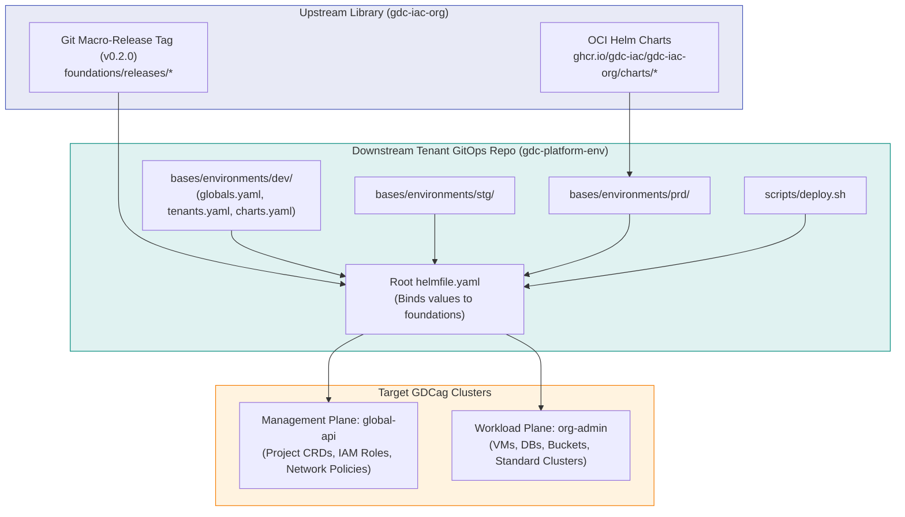
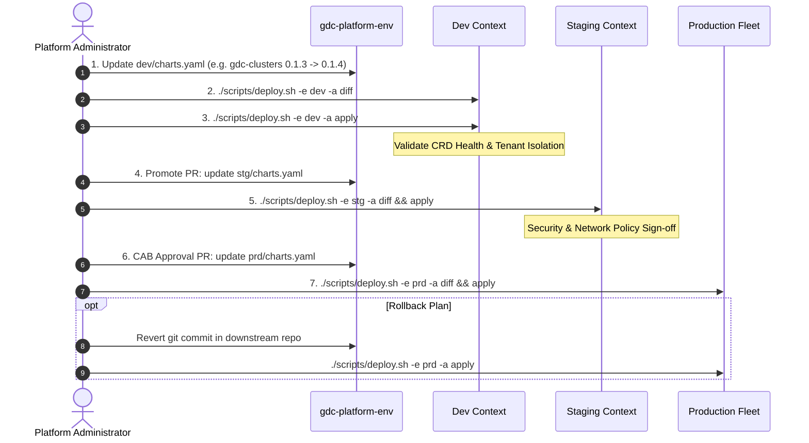

<!--
Copyright 2026 Google LLC

Licensed under the Apache License, Version 2.0 (the "License");
you may not use this file except in compliance with the License.
You may obtain a copy of the License at

    http://www.apache.org/licenses/LICENSE-2.0

Unless required by applicable law or agreed to in writing, software
distributed under the License is distributed on an "AS IS" BASIS,
WITHOUT WARRANTIES OR CONDITIONS OF ANY KIND, either express or implied.
See the License for the specific language governing permissions and
limitations under the License.
-->

# GDC Platform Tenant GitOps Repository (`gdc-platform-env`)

**Operational Paradigm:** Model A — Decoupled Tenant GitOps Repository (Enterprise Standard)  
**Target Platform:** Google Distributed Cloud air-gapped (GDCag 1.16+) & Connected Staging  
**Upstream Blueprint Library:** [`gdc-iac-org`](https://github.com/gdc-iac/gdc-iac-org)  
**Published OCI Charts:** `ghcr.io/gdc-iac/gdc-iac-org/charts`

---

## 1. Architectural Overview

This repository represents the **downstream enterprise platform GitOps repository**. In strict adherence to the **Decoupled Tenant Consumption Model (Model A)**:

- **Zero In-Tree Chart Code:** This repository contains **no Helm chart templates or Go logic**. All reusable logic is pulled from the upstream library repository (`gdc-iac-org`).
- **Configuration & State Only:** This repository contains **only tenant definitions, quota allocations, security bindings, and environment-specific cluster values**.
- **Immutable Release Consumption:** Infrastructure stages are pulled from upstream tagged distribution releases (e.g. `ref=v0.2.0`), while micro-charts are consumed as immutable, cryptographically signed OCI artifacts published to GitHub Container Registry (`ghcr.io/gdc-iac/gdc-iac-org/charts`) or mirrored into an internal air-gapped Harbor registry (`oci://harbor.infra.gdc.example.com/charts`).



---

## 2. Directory Layout

```text
gdc-platform-env/
├── bases/
│   ├── helmDefaults.yaml.gotmpl  # Operational timeouts, atomic settings, and wait flags
│   ├── environments.yaml.gotmpl  # Dynamic environment value binder
│   └── environments/
│       ├── dev/                  # Development cluster values
│       │   ├── globals.yaml      # Cluster contexts (global-api, org-admin), iac-root namespace
│       │   ├── charts.yaml       # Chart paths and pinned versions
│       │   ├── iac.yaml          # Platform IAM roles & tenant IAC setup
│       │   ├── tenants-org-1.yaml# Tenant definitions (projects, service accounts, VMs, DBs)
│       │   ├── tenants-org-2.yaml# Secondary tenant allocations
│       │   └── overrides.yaml    # Environment feature toggles
│       ├── stg/                  # Staging cluster values
│       └── prd/                  # Production fleet cluster values (OCI pinned)
├── helmfile.yaml                 # Root Helmfile orchestrating foundations releases
├── scripts/
│   ├── deploy.sh                 # Turnkey deployment runner (diff, apply, sync)
│   └── validate.sh               # Local linting and template rendering validator
└── README.md                     # Operational runbook
```

---

## 3. Dual-Cluster Control Plane Invariants

All tenant resources declared in `bases/environments/<env>/` strictly enforce GDCag control plane segregation:

1. **Global API Cluster (`global-api` / Management Plane):**
   - Hosts `Project` (`resourcemanager.global.gdc.goog/v1`), `ProjectServiceAccount`, `IAMRole`, `IAMRoleBinding`, and `ProjectNetworkPolicy`.
   - Workload resources (VMs, DBClusters, Buckets) must never be deployed here.
2. **Org Admin Cluster (`org-admin` / Workload Plane):**
   - Hosts localized tenant infrastructure: `VirtualMachine` (`virtualmachine.gdc.goog/v1`), `Bucket` (`object.gdc.goog/v1`), `DBCluster` (`postgresql.dbadmin.gdc.goog/v1`), and `Cluster` (`cluster.gdc.goog/v1`).
3. **State Isolation:**
   - Helm release metadata (`Secret` objects) is stored centrally in the administrative `iac-root` namespace on the target cluster.

---

## 4. Quickstart Runbook

### Step 1: Validate Configuration Locally
Verify that all schemas, YAML structures, and Go templates render cleanly with zero errors:

```bash
# Validate all environments (dev, stg, prd)
./scripts/validate.sh all

# Or validate a specific environment
./scripts/validate.sh dev
```

### Step 2: Dry-Run Inspection (`diff`)
Before modifying any physical cluster resources, inspect the planned Custom Resource mutations:

```bash
./scripts/deploy.sh -e dev -a diff
```

### Step 3: Reconcile Resources (`apply`)
Reconcile the desired state declaratively:

```bash
./scripts/deploy.sh -e dev -a apply
```

> **Note on Initial Bootstrapping:** For first-time environment installation before namespaces exist, execute `./scripts/deploy.sh -e dev -a sync`.

---

## 5. Dual-Mode Chart Resolution

Charts can be resolved through two operational modes depending on network connectivity and environment maturity:

### Mode 1: Local Development (Relative Path)
Used when paired with a local clone of `gdc-iac-org` for rapid development without network calls:
```yaml
# bases/environments/dev/charts.yaml
gdc_projects_chart_path: "../../../charts/gdc-projects"
gdc_clusters_chart_path: "../../../charts/gdc-clusters"
```

### Mode 2: Enterprise OCI Registry (Production / High-Side Staging)
Used in production environments pulling versioned, immutable OCI artifacts:
```yaml
# bases/environments/prd/charts.yaml
gdc_projects_chart_path: "oci://ghcr.io/gdc-iac/gdc-iac-org/charts/gdc-projects"
gdc_projects_chart_version: "0.1.1"

gdc_clusters_chart_path: "oci://ghcr.io/gdc-iac/gdc-iac-org/charts/gdc-clusters"
gdc_clusters_chart_version: "0.1.3"

gdc_vm_chart_path: "oci://ghcr.io/gdc-iac/gdc-iac-org/charts/gdc-vm"
gdc_vm_chart_version: "0.1.5"
```

In air-gapped partitions, replace `ghcr.io/gdc-iac/gdc-iac-org/charts` with the on-premise Harbor registry URL (e.g. `oci://harbor.infra.gdc.example.com/charts`).

---

## 6. Day-2 Upgrade & Promotion Protocol



1. **Development (`dev`):** Update `bases/environments/dev/charts.yaml` with the candidate chart version. Run `diff` and `apply`.
2. **Staging (`stg`):** Open a pull request promoting the tested version into `stg`. Reconcile on staging clusters and conduct security review.
3. **Production (`prd`):** After Change Advisory Board (CAB) approval, merge the PR into `main` and trigger production reconciliation.
4. **Emergency Rollback:** If a regression is detected, revert the Git commit in `gdc-platform-env` and run `deploy.sh -e prd -a apply`. No upstream library changes are required.
